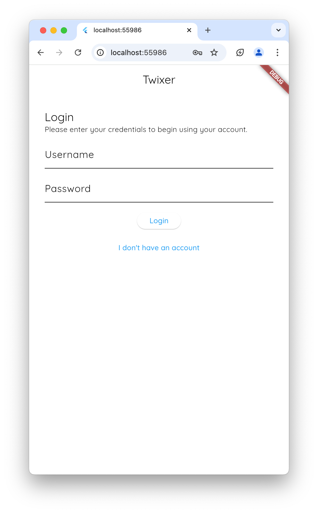
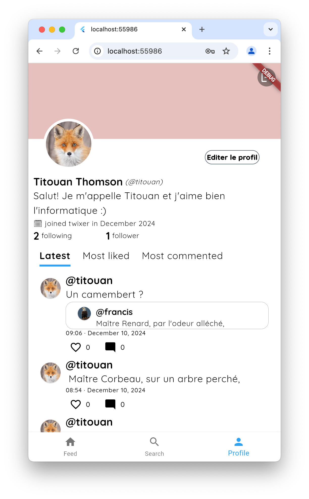
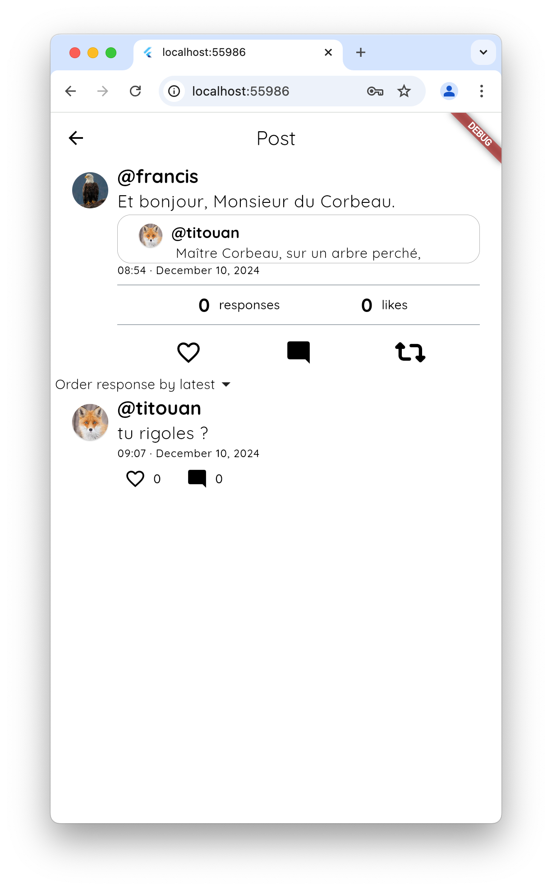
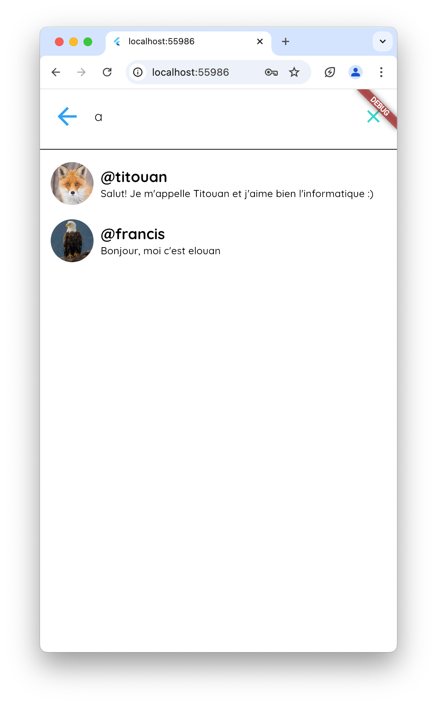

# Twixer
A social media app (and server) based on the concept of Twitter.
The app is coded in dart using the flutter framework which offers cross platform availability. The server is coded in python and is intended to run independently from the app (on a distant server).

## Screenshots

 

## Documentation

You can find [here](Server/doc.md) the API documentation.

## Quickstart

Launch the server by executing server/main.py. This will launch the api on localhost:5000. Start the app locally using flutter run.
Enjoy !
